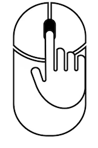

# 🌎 React Earth


## 💻 Run project

```bash
# Open project
$ cd react_earth_threejs_

# Run
$ npm start
```

Runs the app in the development mode.\
Open [http://localhost:3000](http://localhost:3000) to view it in the browser.

The page will reload if you make edits.\
You will also see any lint errors in the console.

### 🔛 `Earth Effects`




## 📚 Documentation
Check the documentation [threejs](https://threejs.org/).

## 📩 Email

That is, if you liked using this application or it helped you in any way, I would like you to email me at <nicolaievbrito@gmail.com> about anything you want to say about this software. I would really appreciate it!

## 🙌 Credits

This software uses the following open source packages:

- [React.js](https://es.react.dev/)
- [Three.JS](https://threejs.org/)

## 🔧 Support
<nicolaievbrito@gmail.com>

---

> GitHub [@nicolaievpustelnik](https://github.com/nicolaievpustelnik) &nbsp;
